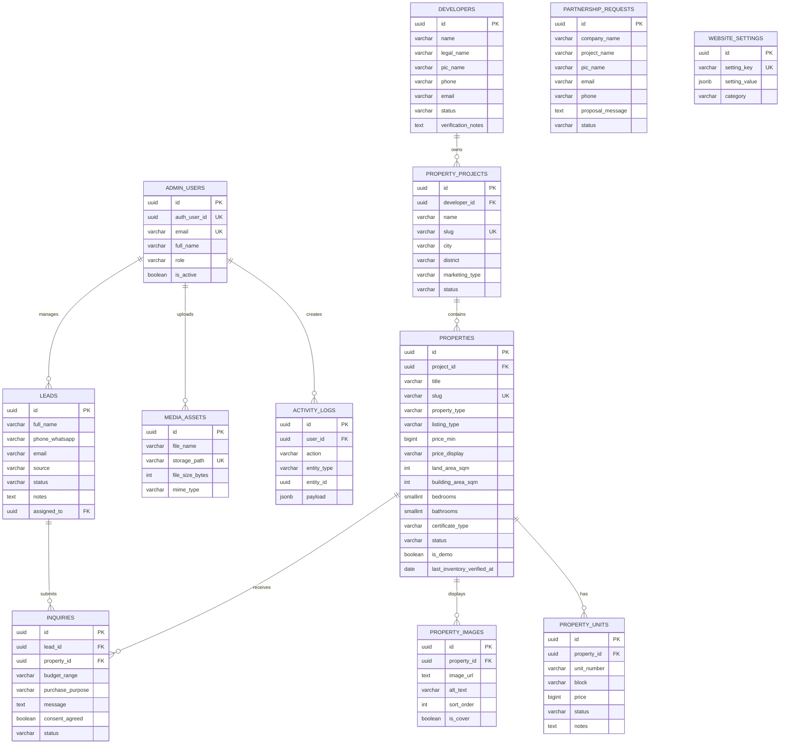

# ENTITY RELATIONSHIP DIAGRAM (ERD)
## Robby Viory Fansya – Independent Property Agent Platform

```mermaid
erDiagram
    ADMIN_USERS ||--o{ ACTIVITY_LOGS : creates
    ADMIN_USERS ||--o{ MEDIA_ASSETS : uploads
    ADMIN_USERS ||--o{ LEADS : manages
    DEVELOPERS ||--o{ PROPERTY_PROJECTS : owns
    PROPERTY_PROJECTS ||--o{ PROPERTIES : contains
    PROPERTIES ||--o{ PROPERTY_UNITS : has
    PROPERTIES ||--o{ PROPERTY_IMAGES : displays
    PROPERTIES ||--o{ INQUIRIES : receives
    LEADS ||--o{ INQUIRIES : submits

    DEVELOPERS {
        uuid id PK
        varchar name
        varchar legal_name
        varchar pic_name
        varchar phone
        varchar email
        varchar status
        text verification_notes
    }

    PROPERTY_PROJECTS {
        uuid id PK
        uuid developer_id FK
        varchar name
        varchar slug UK
        varchar city
        varchar district
        varchar marketing_type
        varchar status
    }

    PROPERTIES {
        uuid id PK
        uuid project_id FK
        varchar title
        varchar slug UK
        varchar property_type
        varchar listing_type
        bigint price_min
        varchar price_display
        int land_area_sqm
        int building_area_sqm
        smallint bedrooms
        smallint bathrooms
        varchar certificate_type
        varchar status
        boolean is_demo
        date last_inventory_verified_at
    }

    PROPERTY_UNITS {
        uuid id PK
        uuid property_id FK
        varchar unit_number
        varchar block
        bigint price
        varchar status
        text notes
    }

    PROPERTY_IMAGES {
        uuid id PK
        uuid property_id FK
        text image_url
        varchar alt_text
        int sort_order
        boolean is_cover
    }

    LEADS {
        uuid id PK
        varchar full_name
        varchar phone_whatsapp
        varchar email
        varchar source
        varchar status
        text notes
        uuid assigned_to FK
    }

    INQUIRIES {
        uuid id PK
        uuid lead_id FK
        uuid property_id FK
        varchar budget_range
        varchar purchase_purpose
        text message
        boolean consent_agreed
        varchar status
    }

    PARTNERSHIP_REQUESTS {
        uuid id PK
        varchar company_name
        varchar project_name
        varchar pic_name
        varchar email
        varchar phone
        text proposal_message
        varchar status
    }

    ADMIN_USERS {
        uuid id PK
        uuid auth_user_id UK
        varchar email UK
        varchar full_name
        varchar role
        boolean is_active
    }

    WEBSITE_SETTINGS {
        uuid id PK
        varchar setting_key UK
        jsonb setting_value
        varchar category
    }

    MEDIA_ASSETS {
        uuid id PK
        varchar file_name
        varchar storage_path UK
        int file_size_bytes
        varchar mime_type
    }

    ACTIVITY_LOGS {
        uuid id PK
        uuid user_id FK
        varchar action
        varchar entity_type
        uuid entity_id
        jsonb payload
    }
```
